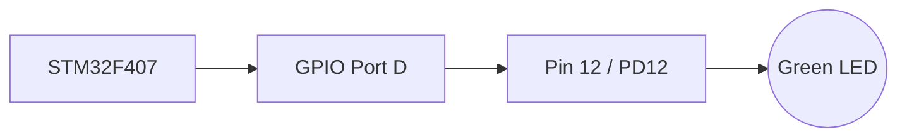
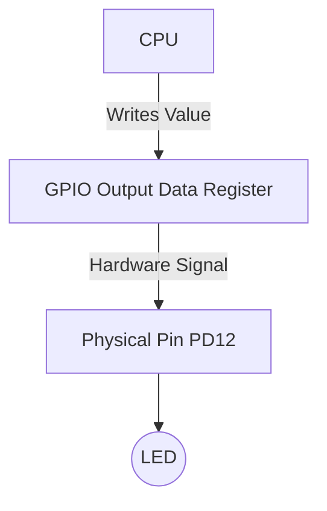
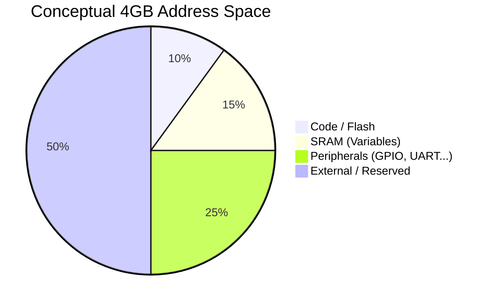
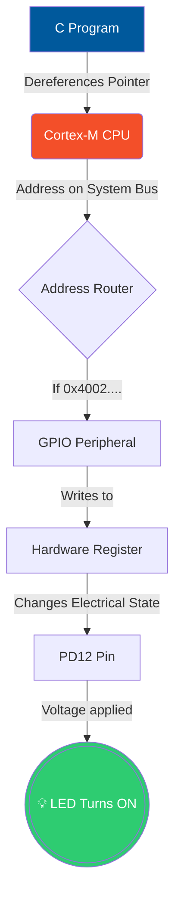

# GPIO, Memory-Mapped I/O & The Processor Memory Map 🗺️

> **Lectures 111–113** — *The crucial bridge connecting C code to physical hardware.*

---

## 🎯 Learning Objectives

After this lecture, you will understand:
* What a **GPIO** actually is (beyond just input/output).
* How software communicates with hardware using **Registers**.
* The magic of **Memory-Mapped I/O** (why pointers are so important).
* What a **Memory Map** is and why a 4GB address space does NOT mean 4GB of RAM.
* The complete path from a **C pointer to a physical LED**.

---

## 1. The Hardware Goal 💡

We want to blink a Green LED on the **STM32F4 Discovery (STM32F407)**.
The LED is physically wired to **PD12**.

* **P** = Port
* **D** = Port D
* **12** = Pin 12



If our software can control **PD12**, we control the LED.

---

## 2. What is a GPIO Peripheral?

**GPIO = General Purpose Input/Output**

A GPIO pin is not restricted to just being a digital HIGH/LOW. It is **"General Purpose"** because the same physical pin can be configured for:

* Digital Output (LED)
* Digital Input (Button)
* Alternate Functions (UART TX/RX, SPI, I2C, ADC, etc.)

> [!NOTE]
> **A GPIO is a hardware peripheral block** inside the MCU that controls a group of pins (a "Port"). 
> Examples: `GPIOA`, `GPIOB`, `GPIOC`, `GPIOD`...

---

## 3. How Software Controls Hardware (Registers)

The CPU does not just say `PD12 = HIGH`. Instead, it talks to the GPIO peripheral via **Registers**.

Registers are the control knobs and dials for the hardware.

| Register Name | Purpose |
| :--- | :--- |
| **Mode Register** | Sets pin as Input, Output, or Alternate Function |
| **Output Data Register** | Sets the pin HIGH (1) or LOW (0) |
| **Input Data Register** | Reads if the pin is HIGH or LOW |



> **Registers are the control interface between software and hardware peripherals.**

---

## 4. Memory-Mapped I/O (The Magic Trick) ✨

Where do these registers live? 
ARM assigns **memory addresses** to these peripheral registers, just like normal variables in RAM.

This is called **Memory-Mapped I/O**.

> **Memory-mapped I/O:** Peripheral registers are assigned addresses within the processor's address space. The CPU can access peripherals using normal memory read/write operations (Pointers!).

| Resource | Example Address |
| :--- | :--- |
| Variable in RAM | `0x20000004` |
| **GPIOD Register** | `0x40020C00` |

Because it has a memory address, we can use a **C Pointer** to write to it!

```c
// Concept of Memory-Mapped I/O in C
uint32_t *gpiod_mode_reg = (uint32_t *)0x40020C00;
*gpiod_mode_reg = 0x01000000; // Hardware instantly reacts to this write!
```

---

## 5. The Processor Memory Map 🗺️

The **STM32F407 uses a 32-bit ARM Cortex-M4**.
A 32-bit address bus means it can generate $2^{32}$ unique addresses.
$2^{32} \text{ bytes} = 4 \text{ GB}$

> [!WARNING]
> **4 GB Address Space ≠ 4 GB Physical RAM!**
> It means the processor can address up to 4GB of *locations*. 

The **Memory Map** tells us how this 4GB space is divided.



When the CPU places `0x08000000` on the bus, it talks to **Flash**.
When the CPU places `0x40020C00` on the bus, it talks to **GPIOD**.
The address itself routes the request to the correct physical hardware block!

---

## 6. The Complete Chain: C Code to LED 🔗

This is the most important mental model for Embedded C. Memorize this flow:



## 🔥 Summary of Key Terms for Interviews

1. **GPIO:** General Purpose Input/Output. The peripheral that controls physical pins.
2. **GPIO Port:** A grouping of pins (e.g., Port D has pins PD0–PD15).
3. **Register:** A hardware location used to configure or control a peripheral.
4. **Memory-Mapped I/O:** Assigning memory addresses to peripheral registers so the CPU can control them using normal memory instructions.
5. **Memory Map:** The architectural blueprint defining which address ranges correspond to Flash, RAM, and Peripherals.
